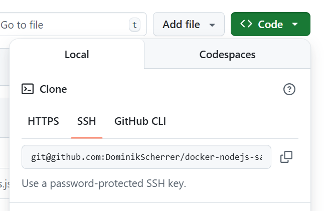
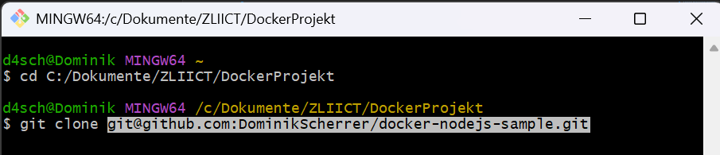
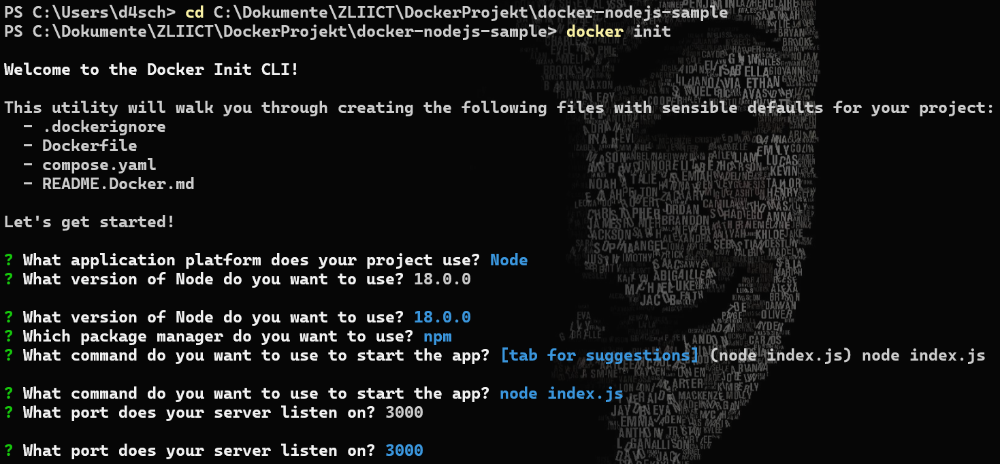
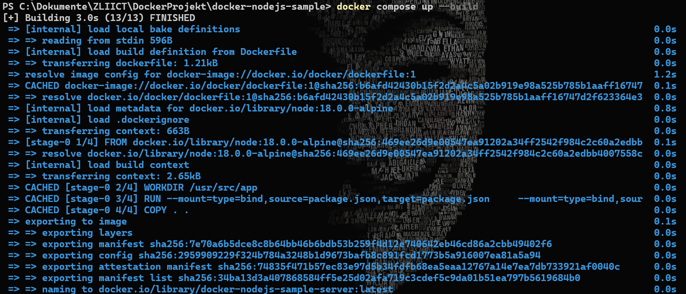

# Anleitung Installation To-Do Applikation
---
[TOC]

*In dieser Anleitung zum Abschlussprojekt von KW43 erkläre ich folgende Schritte:*
* *Klonen des Repositories*
* *Installation der notwendigen Pakete*
* *Docker-Konfiguration und -Installation*
* *Starten der Applikation in einem Docker-Container*

## Schritt 1 - Klonen des Repositories
1. Um das gesamte Repositorie von GitHub zu Klonen, muss man zuerst den SSH-Schlüssel in GitHub Kopieren.

2. Danach muss man in GitBash zum Ordner wechseln, indem man das Repositorie Lokal haben will. Anschliessend muss man mit "git clone <kopierter SSH-Schlüssel>" das Repositorie Klonen.

## Schritt 2 - Docker Initialisieren
1. Um den Docker zu Initialisieren muss man im Terminal zuerst den Pfad zum Ordner docker-nodejs.sample angeben. Dannach muss man mit "doker init" den Docker Initialisieren und verschiedene Fragen beantworten.

2. Die Fragen muss man so beantworten:
- ? What application platform does your project use? **Node**
- ? What version of Node do you want to use? **18.0.0**
- ? Which package manager do you want to use? **npm**
- ? What command do you want to use to start the app: **node src/index.js**
- ? What port does your server listen on? **3000**

Nun sollte man folgenden Inhalt im "docker-nodejs-sample" -Verzeichnis haben:
* spec/
* src/
* .dockerignore
* .gitignore
* compose.yaml
* Dockerfile
* package-lock.json
* package.json
* README.md

## Schritt 3 - Starte die Applikation
1. Gib im Terminal (wieder im Verzeichnis "docker-nodejs-sample") den "docker compose up --build" Befehl ein, um die Applikation zu Starten:

2. Mit diesem [Link](http://localhost:3000) kann man im Browser die Applikation öffnen.
3. Wenn man die Applikation stoppen möchte, muss man im Terminal die Tastenkombination "strg + c" benutzen.
